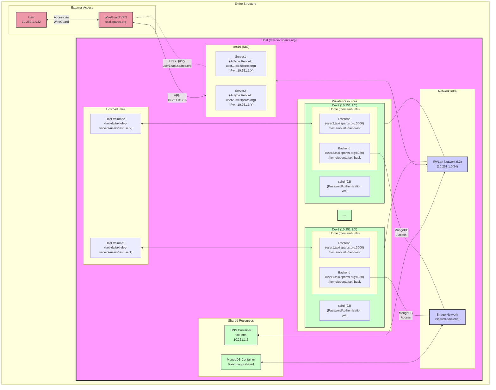

# Taxi Dev Center

VPN-based, containerized development workspace for Taxi members.

## About

Taxi Dev Center는 Taxi 팀원들을 위한 격리된 개발 환경을 제공하는 서비스입니다. Docker 컨테이너로 각 개발자에게 독립적인 환경을 제공하며, 컨테이너들은 공용 MongoDB와 통신합니다. 팀원들은 SPARCS VPN과 DNS를 통해 자신의 컨테이너에 도메인으로 접근할 수 있습니다.

각 개발자는 다음과 같은 환경을 제공받습니다:

- SSH 접근이 가능한 독립된 개발 컨테이너
- 개인 MongoDB 데이터베이스 계정 및 접근 권한
- 전용 DNS 레코드 (username.taxi.sparcs.org)
- 격리된 프론트엔드 (포트 3000) 및 백엔드 (포트 8080) 서비스
## Architecture



## Directory Structure
```
taxi-dc/
├── taxi-dev-servers/                           # Main development server component
│   ├── modules/                                # Core functionality modules
│   │   ├── container_manager.py                # Docker container management
│   │   ├── dns_manager.py                      # DNS configuration and management
│   │   └── mongo_manager.py                    # MongoDB interaction and management
│   ├── scripts/                                # Automation and setup scripts
│   │   └── entrypoint.sh                       # Container initialization script
│   ├── users/                                  # Taxi Front/back repositories for all users
│   ├── docker-compose-files/                   # Docker compose files for all users
│   ├── Dockerfile                              # Main service Dockerfile
│   ├── Dockerfile.base                         # Base image configuration
│   └── app.py                                  # Main application entry point
├── taxi-dns/                                   # DNS service component
│   ├── dns_backups/                            # DNS configuration backups
│   ├── dnsmasq.conf                            # Active DNS configuration
│   └── dnsmasq.conf.template                   # Template for DNS configuration
├── Configuration Files
│   ├── docker-compose.shared.yml               # Shared Docker configuration
│   ├── docker-compose.private.template.yaml    # Private Docker template
│   ├── requirements.txt                        # Python dependencies
│   ├── .dockerignore                           # Docker ignore rules
│   └── .gitignore                              # Git ignore rules
└── Environment Files
    ├── .env                                    # Main environment variables
    ├── .env.back.development                   # Backend dev environment
    ├── .env.back.test                          # Backend test environment
    └── .env.front                              # Frontend environment
```

## Project Setup

1. Create environment files from templates:
   ```bash
   cp .env.template .env
   cp .env.back.development.template .env.back.development
   cp .env.back.test.template .env.back.test
   cp .env.front.template .env.front
   ```

2. Set up Python virtual environment:
   ```bash
   python -m venv taxi-env
   source taxi-env/bin/activate
   pip install -r requirements.txt
   ```

3. Start shared services:
   ```bash
   docker compose -f docker-compose.shared.yml up -d
   ```

## Running Taxi-DC

1. Activate virtual environment:
   ```bash
   source taxi-env/bin/activate
   ```

2. Run the management application:
   ```bash
   python taxi-dev-servers/app.py
   ```

3. Available commands:
   - List all entries (containers, DNS, MongoDB)
   - Create new development environment
   - Edit user configurations
   - Remove development environment

## Using Development Containers

1. In SPARCS VPN Configuration, add the following line under the `[Interface]` section
    ```ini
    DNS = 10.251.1.2

    ```
2. SSH Into Development Container Using Custom DNS
    ```bash
    ssh ubuntu@username.taxi.sparcs.org
    ```

3. In the backend directory, run the following comands to setup and run the backend server
    ```bash
    cd ~/taxi-back
    pnpm i
    pnpm build
    pnpm sample
    pnpm start
    ```

4. In the frontend directory, run the following comands to setup and run the frontend server
    ```bash
    cd ~/taxi-front
    pnpm i
    pnpm build:all
    pnpm start:web
    ```

5. See the deployed application by opening your browser at http://username.taxi.sparcs.org:3000

## Flow

